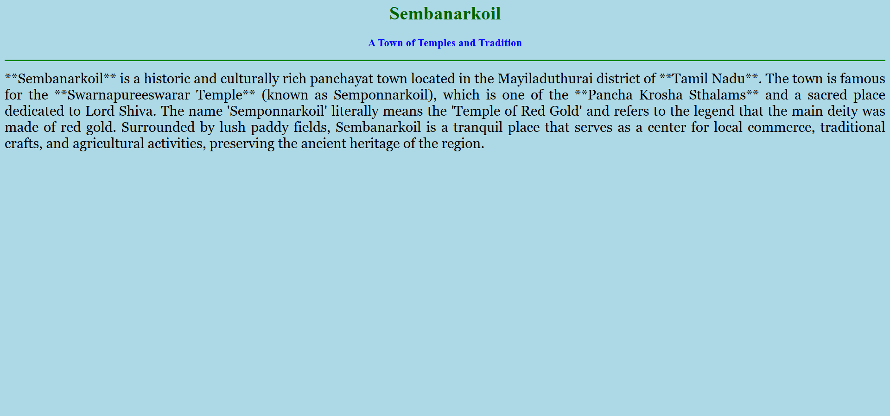

# Ex04 Places Around Me
## Date: 

## AIM
To develop a website to display details about the places around my house.

## DESIGN STEPS

### STEP 1
Create a Django admin interface.

### STEP 2
Download your city map from Google.

### STEP 3
Using ```<map>``` tag name the map.

### STEP 4
Create clickable regions in the image using ```<area>``` tag.

### STEP 5
Write HTML programs for all the regions identified.

### STEP 6
Execute the programs and publish them.

## CODE
~~~
map.html

<html>
<head>
<title>My City</title>
</head>
<body>
<h1 align="center">
<font color="red"><b>sembanarkoil</b></font>
</h1>
<h3 align="center">
<font color="blue"><b>dharshan (25008132)</b></font>
</h3>
<center>
<!-- Image Map Generated by http://www.image-map.net/ -->


<map name="image-map">
     <area target="_self" alt="sembanarkoil" title="sembanarkoil" href="home.html" coords="864,561,1056,688" shape="rect">
     <area target="_self" alt="temple" title="temple" href="kalahasthinathapuram.html" coords="1622,498,1893,613" shape="rect">
     <area target="_self" alt="temple" title="temple" href="amman temple.html" coords="751,271,969,420" shape="rect">
     <area target="_self" alt="temple" title="temple" href="shri gatra sundareshwarar temple.html" coords="236,258,542,397" shape="rect">
</center>
</body>
</html>

home.html

 <html>
<head>
 <title>My Home Town</title>
</head>
<body bgcolor="lightblue">

 <h1 align="center">
 <font color="darkgreen"><b>Sembanarkoil</b></font>
 </h1>

 <h3 align="center">
 <font color="blue"><b>A Town of Temples and Tradition</b></font>
 </h3>

 <hr size="3" color="green">

 <p align="justify">
 <font face="Georgia" size="5">
 *Sembanarkoil* is a historic and culturally rich panchayat town located in the Mayiladuthurai district of *Tamil Nadu*. 
 The town is famous for the *Swarnapureeswarar Temple* (known as Semponnarkoil), which is one of the *Pancha Krosha Sthalams* and a sacred place dedicated to Lord Shiva. 
 The name 'Semponnarkoil' literally means the 'Temple of Red Gold' and refers to the legend that the main deity was made of red gold. 
 Surrounded by lush paddy fields, Sembanarkoil is a tranquil place that serves as a center for local commerce, traditional crafts, and agricultural activities, preserving the ancient heritage of the region.
 </font>
 </p>

</body>
</html>

amman temple.html

<html>
<head>
<title>My Home Town</title>
</head>
<body bgcolor="lightblue">

 <h1 align="center">
 <font color="darkgreen"><b>Sembanarkoil</b></font>
 </h1>

 <h3 align="center">
 <font color="blue"><b>Arulmigu Angala Parameshwari Amman Kovil</b></font>
 </h3>

 <hr size="3" color="green">

 <p align="justify">
 <font face="Georgia" size="5">
 Sembanarkoil is also home to a number of powerful temples, including the sacred shrine of *Arulmigu Angala Parameshwari Amman. This ancient temple, often referred to as **Angalamman Koil*, is situated close to the main town and is a major center for the worship of the Goddess of Protection.
 The temple is renowned for its annual *Mayanakkollai festival*, which is celebrated with great fervor on the day following Mahashivarathri. Devotees gather for this unique ritual to seek the powerful blessings of the Amman. The temple reflects the deep-rooted tradition of Sakthi (Goddess) worship in the region, drawing pilgrims who come to pray for health, prosperity, and protection from all forms of adversity.
 </font>
 </p>

</body>
</html>

kalahasthinathapuram.html

<html>
<head>
 <title>My Home Town</title>
</head>
<body bgcolor="lightblue">

 <h1 align="center">
 <font color="darkgreen"><b>Kalahasthinathapuram</b></font>
 </h1>

 <h3 align="center">
 <font color="blue"><b>Home to the Sacred Kalahasteeswarar Temple</b></font>
 </h3>

 <hr size="3" color="green">

 <p align="justify">
 <font face="Georgia" size="5">
 *Kalahasthinathapuram* is a village located in the Tharangambadi Taluk of the Nagapattinam district, Tamil Nadu. It is a place of agricultural importance and traditional life. The village is spiritually significant due to its association with a temple dedicated to Lord Shiva, locally known as *Sri Kalahasteeswara Swamy*.
 Devotees believe that praying at this ancient shrine is equivalent to offering prayers at the famous Sri Kalahasti temple in Andhra Pradesh, giving it immense religious importance. The temple is considered a *Vaayu Sthalam* and is a revered spot for removing the Kaala Sarpa Dosham, attracting pilgrims seeking divine blessings. The area reflects the deep-rooted cultural and devotional practices of the region.
 </font>
 </p>

</body>
</html>

shri gatra sundareshwarar temple.html

<html>
<head>
<title>My Home Town</title>
</head>
<body bgcolor="lightblue">

    <h1 align="center">
<font color="darkgreen"><b>Shri Kathra Sundareswarar Temple</b></font>
 </h1>

 <h3 align="center">
 <font color="blue"><b>Kanjanagaram - The Krithika Nakshatra Temple</b></font>
 </h3>

 <hr size="3" color="green">

 <p align="justify">
   <font face="Georgia" size="5">
 The *Shri Kathra Sundareswarar Temple, located in **Kanjanagaram* near Mayiladuthurai, is one of the most significant Shiva temples in Tamil Nadu, especially revered as the Parihara Sthalam (remedial site) for those born under the *Krithika (Karthikai) star*.
  Lord Shiva here graces as a Swayambhu Lingam (self-manifested deity) facing the rare West direction. The Goddess, *Thunga Bala Sthanambigai, holds a unique significance as she is seen with a parrot, believed to be Lord Shiva Himself reciting the Vedas (*Veda Amirtha Keeram). The temple is also the birthplace of *Manakkanjarar, one of the 63 Nayanmars, and is linked to the origin of Lord Muruga (Karthikeya) from the six sparks (*Kathra Jyoti) of Lord Shiva's eye.
 </font>
 </p>

</body>
</html>
~~~

## OUTPUT




## RESULT
The program for implementing image maps using HTML is executed successfully.
